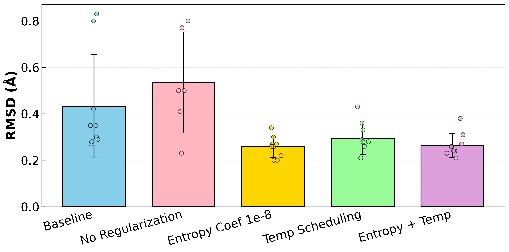
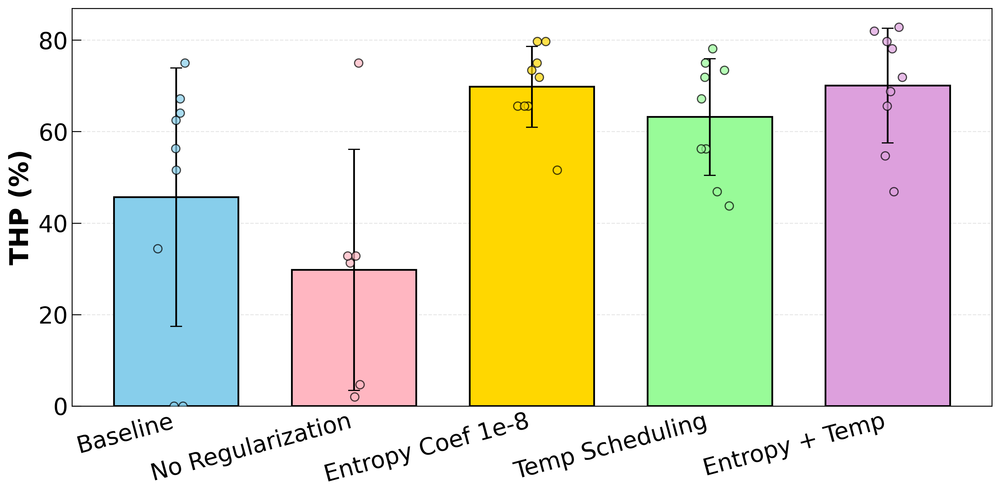
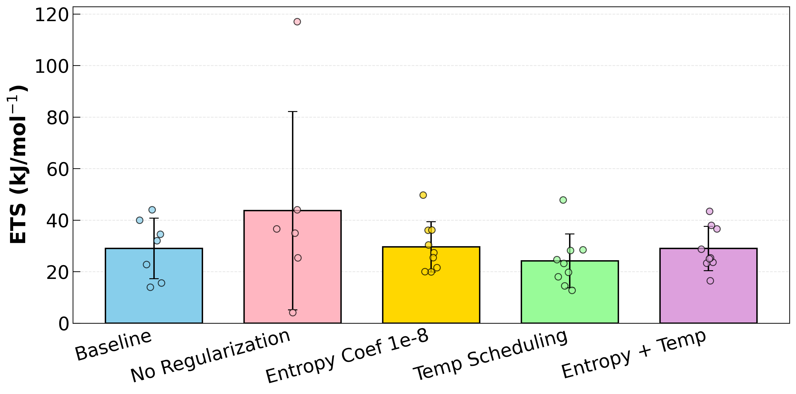

# CS582 course project

This repository contains CS582 course project to improve the TPS-DPS [](https://arxiv.org/abs/2405.19961) by applying force distribution approach

## Installation
```
conda env create -f environment.yml
conda activate tps-dps
```


## Steps to reproduce the results
We provide instructions to reproduce the results of aldp and train a new model. You can replace aldp with fast-folding proteins: chignolin, trpcage, bba, and bbl.

- **Training**: Run the following command to start training from scratch with sampling bias from distributions
    ```
    bash scripts/train/aldp_force_dist.sh
    ```

## Results

The following training configurations are available:

- **Baseline**: Standard TPS-DPS training
- **No Regularization**: Force distribution training without entropy regularization
- **Entropy Coefficient (1e-8)**: Force distribution training with entropy regularization
- **Temperature Scheduling**: Training with adaptive temperature scheduling
- **Entropy + Temperature**: Combined entropy regularization and temperature scheduling

### RMSD Comparison


### THP Comparison


### ETS Comparison



## Contributors
- Shane Wang  
- Jingqian Liu  
- Siddharth Krishnan
